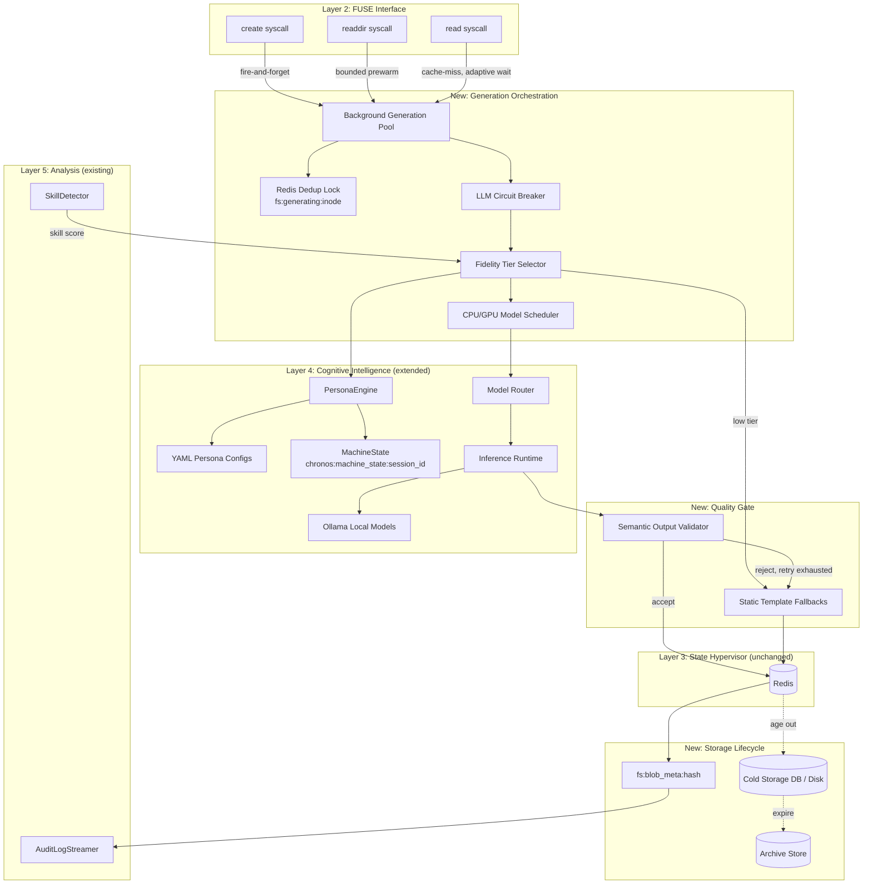
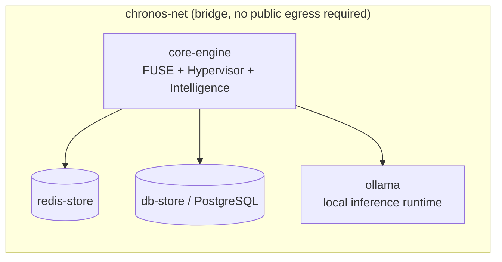
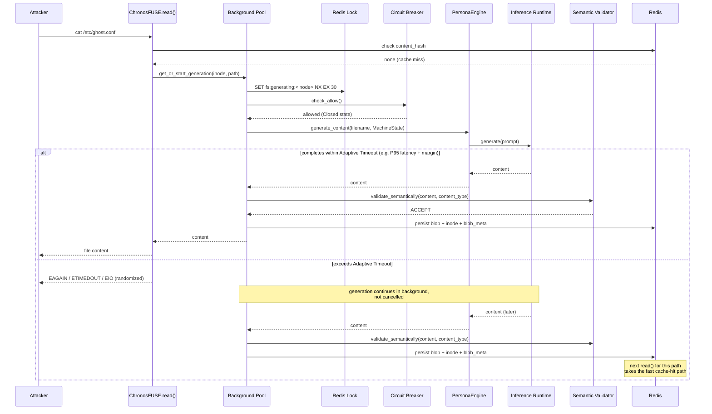
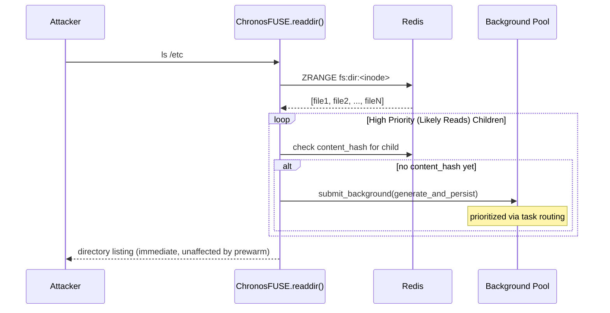
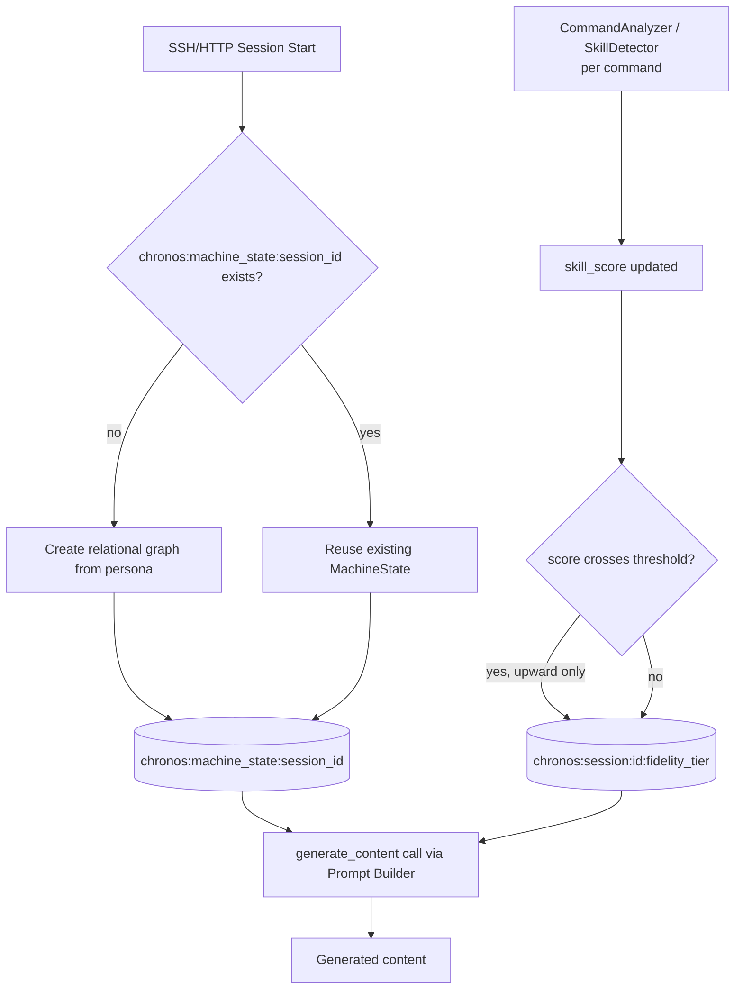
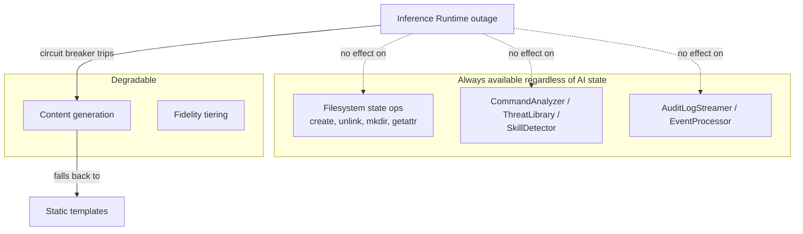

# Chronos AI Architecture Reference

**Purpose:** Component layout, data flow, deployment topology, and storage
schema for the AI integration described in `AI_ROADMAP.md`, implementing
the decision logic in `AI_LOGIC.md`.

This extends `docs/ARCHITECTURE.md` — it does not replace it. The six-layer
architecture (Gateway → FUSE → State Hypervisor → Cognitive Intelligence →
Analysis → Layer 0) is unchanged; this document zooms into Layer 4
(Cognitive Intelligence) and its new dependencies.

---

## 1. Component Map

---

## 2. Deployment Topology

**Key deployment decision:** `ollama` runs as a sibling container on
`chronos-net`, same pattern as `redis-store`/`db-store`. This ensures the entire stack is air-gapped — no attacker-facing container needs public internet access. Abstractions for external providers (OpenAI, Anthropic) have been removed in favor of a robust local-first **Inference Runtime** and **Model Router**.

**Resource note:** `docker-compose.prod.yml` currently caps `core-engine`
at 2 CPU / 2GB. Ollama needs its own budget, ideally GPU-backed if available.

---

## 3. Storage Lifecycle and Schema Additions

Extends the existing schema in `docs/ARCHITECTURE.md §1`. All new keys are additive.

### Redis Additions

| Key Pattern | Type | Purpose | TTL |
|---|---|---|---|
| `fs:generating:<inode>` | String (lock) | Cross-process generation dedup | 30s |
| `chronos:machine_state:<session_id>` | Hash/JSON | Relational world model (hostname, user, IP, services) | Session lifetime |
| `fs:blob_meta:<hash>` | Hash | Provenance: persona, model, prompt, seed, temp, top_p, generated_at, validated, fidelity | None (persists with blob) |
| `chronos:session:<session_id>:fidelity_tier` | String | Current escalated fidelity tier for the session | Session lifetime |
| `chronos:metrics:llm:*` | Counters/Histograms | Generation latency, timeout count, semantic validation pass/fail | None |

### Storage Tiering

To prevent unbounded storage growth from millions of generated blobs, Chronos implements a storage lifecycle:
1.  **Hot (Memory/Cache):** Frequently accessed files and recently generated dynamic files.
2.  **Warm (Redis):** Standard `fs:blob:<hash>` storage for the active session.
3.  **Cold (Disk / PostgreSQL):** Files that haven't been accessed in a defined period but belong to an active session.
4.  **Archive / Delete:** Files belonging to expired sessions are aged out and deleted to reclaim space.

---

## 4. Sequence: Cache-Miss Read With Adaptive Timeout

---

## 5. Sequence: Predictive Generation on `readdir()`

---

## 6. MachineState & Fidelity: Data Ownership

This makes explicit that **MachineState and fidelity tier are independent axes**:
a low-fidelity session (`template_only`) still uses the same locked relational state if it later escalates. Consistency doesn't reset when fidelity changes, only richness does.

---

## 7. Failure Domain Isolation

---

## 8. What This Does *Not* Change

To keep this document scoped correctly:

- **FUSE syscall semantics** (`getattr`, `readdir`, `unlink`, `rmdir`,
  `chmod`, `chown`, `truncate`) are untouched — only `read()` and `create()`
  gain new orchestration logic.
- **Atomic Lua scripts** (`atomic_create.lua`) are untouched — inode
  allocation and directory linking remain exactly as fast and atomic as
  before.
- **Layer 0 (Rust)** is untouched — protocol classification, circuit
  breaking for traffic, and noise detection operate independently of
  anything in this document.
