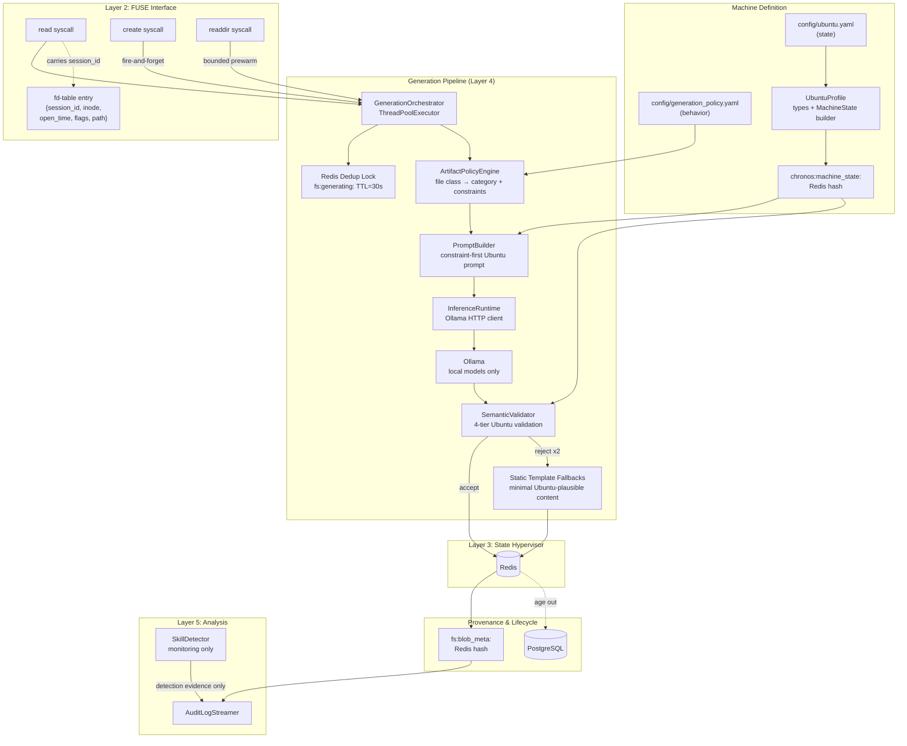
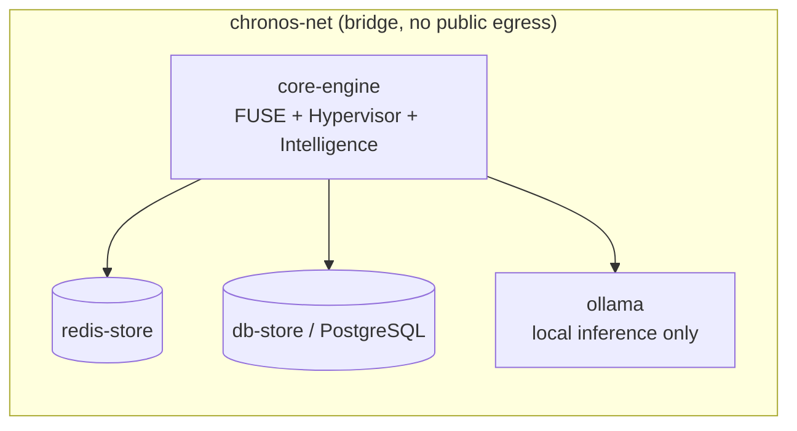
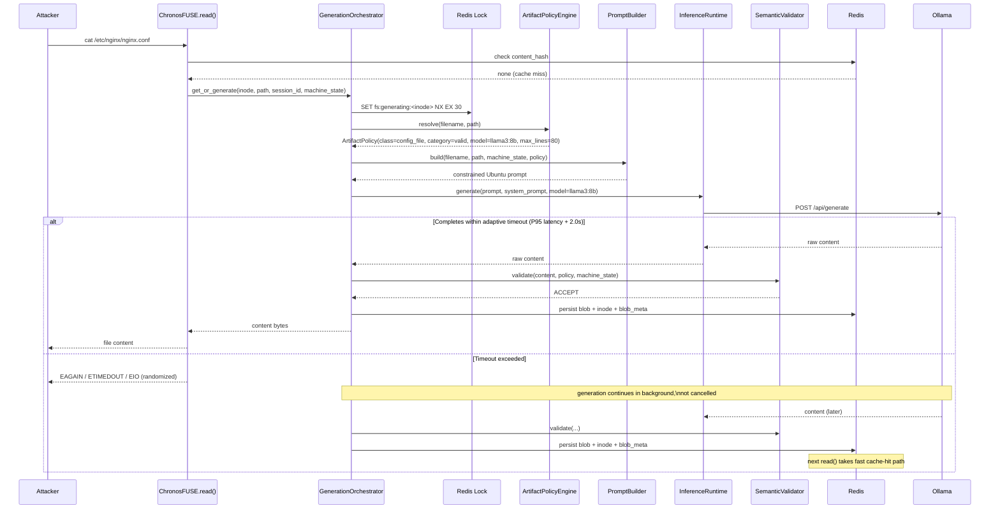
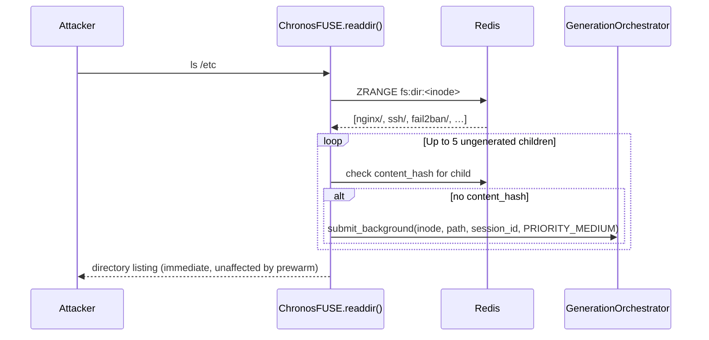
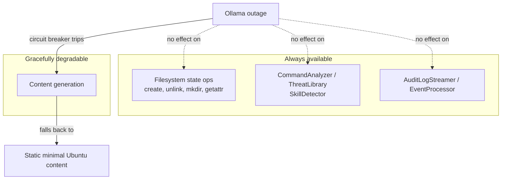

# Chronos AI Architecture Reference

**Purpose:** Component layout, data flow, deployment topology, and storage
schema for the AI integration described in `AI_ROADMAP.md`.

This extends `docs/ARCHITECTURE.md` — it does not replace it. The six-layer
architecture (Gateway → FUSE → State Hypervisor → Cognitive Intelligence →
Analysis → Layer 0) is unchanged; this document zooms into Layer 4
(Cognitive Intelligence) and its dependencies.

**Governing principle:**
> Chronos is not an AI-powered operating system. It is a deterministic Ubuntu honeypot
> that uses AI only to generate plausible artifacts under strict constraints.

---

## 1. Component Map



> **Note:** `SkillDetector` feeds monitoring/logging only. It does **not** influence
> which model generates content. Model routing depends solely on file class.

---

## 2. Deployment Topology



The entire stack is air-gapped. No container requires public internet access.
There are no cloud LLM providers (OpenAI, Anthropic) in this architecture.
All inference is handled by Ollama running as a sibling container on `chronos-net`.

**Resource note:** `ollama` needs its own CPU/memory budget in `docker-compose.prod.yml`.
GPU-backed inference is supported via Docker device passthrough if available.

---

## 3. Storage Schema Additions

All new Redis keys are additive to the existing schema in `docs/ARCHITECTURE.md §1`.

### Redis Additions

| Key Pattern | Type | Purpose | TTL |
|---|---|---|---|
| `fs:generating:<inode>` | String (lock) | Cross-thread generation dedup | 30s |
| `chronos:machine_state:<session_id>` | Hash | Ubuntu machine state per session (packages, services, users, ports, …) | Session lifetime |
| `fs:blob_meta:<hash>` | Hash | Provenance: ubuntu_version, kernel_version, model, file_class, category, generated_at, validated | Persists with blob |
| `chronos:metrics:latency:<model>` | JSON list | Rolling 50-sample latency window for adaptive timeout calculation | None |
| `chronos:quota:<session_id>:<window>` | Integer | Per-session inference quota counter (token bucket) | 2× quota window |

### Storage Tiering

| Tier | Storage | Contents |
|---|---|---|
| Hot | Redis memory | Recently accessed blobs, active session MachineState |
| Warm | Redis persistent | Standard `fs:blob:<hash>` for active sessions |
| Cold | PostgreSQL | Blobs from sessions inactive > threshold |
| Archive/Delete | — | Blobs from expired sessions, aged out |

---

## 4. Sequence: Cache-Miss Read With Adaptive Timeout



---

## 5. Sequence: Predictive Generation on `readdir()`



---

## 6. MachineState: Data Ownership

```mermaid
graph TD
  SSHConnect[SSH Connection] --> SessionID[Generate session_id\nuuid4]
  SessionID --> CtxInject["threading.local\nfuse_context.session_id"]
  CtxInject --> FUSEOpen["fuse.open()\nfd_table[fd] = {session_id, inode, open_time, flags, path}"]

  FUSEOpen --> StateCheck{"chronos:machine_state\n:session_id exists?"}
  StateCheck -->|no| CreateState[UbuntuProfile.build_machine_state()]
  CreateState --> UbuntuYAML[config/ubuntu.yaml]
  CreateState --> StateStore[(Redis: machine_state hash)]
  StateCheck -->|yes| StateStore

  StateStore --> Generation[PromptBuilder\nextracts relevant subgraph]
  Generation --> Output[Generated Ubuntu artifact]
```

MachineState is created once per session from `ubuntu.yaml` and frozen.
AI cannot modify MachineState — it only reads the relevant subgraph when building prompts.

---

## 7. Failure Domain Isolation



---

## 8. What This Does *Not* Change

- **FUSE syscall semantics** (`getattr`, `readdir`, `unlink`, `rmdir`, `chmod`, `chown`, `truncate`) are untouched — only `read()` and `create()` gain orchestration logic.
- **Atomic Lua scripts** (`atomic_create.lua`) are untouched — inode allocation and directory linking remain atomic and fast.
- **Layer 0 (Rust)** is untouched — traffic classification and circuit breaking operate independently.
- **SkillDetector** remains unmodified — its output goes to monitoring only, not to model selection.
