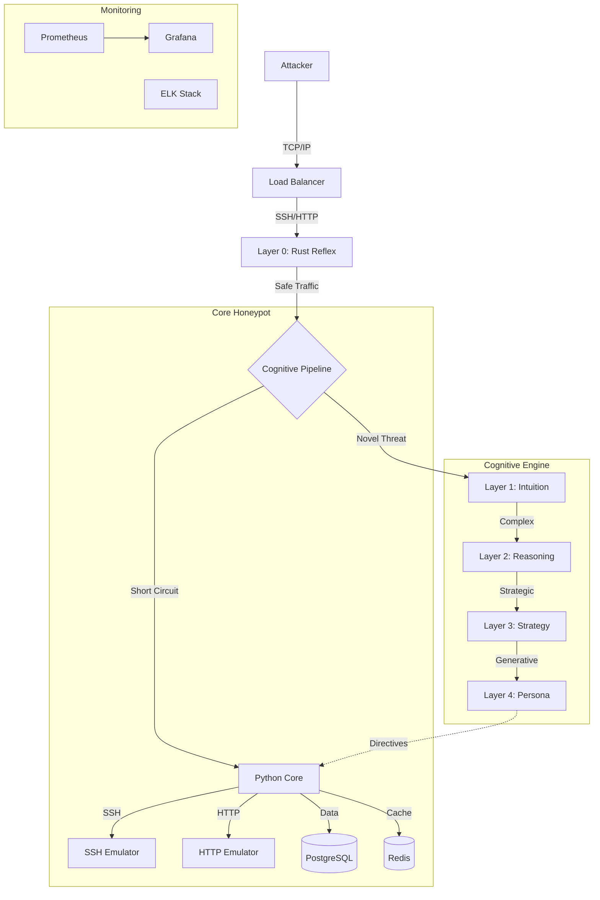
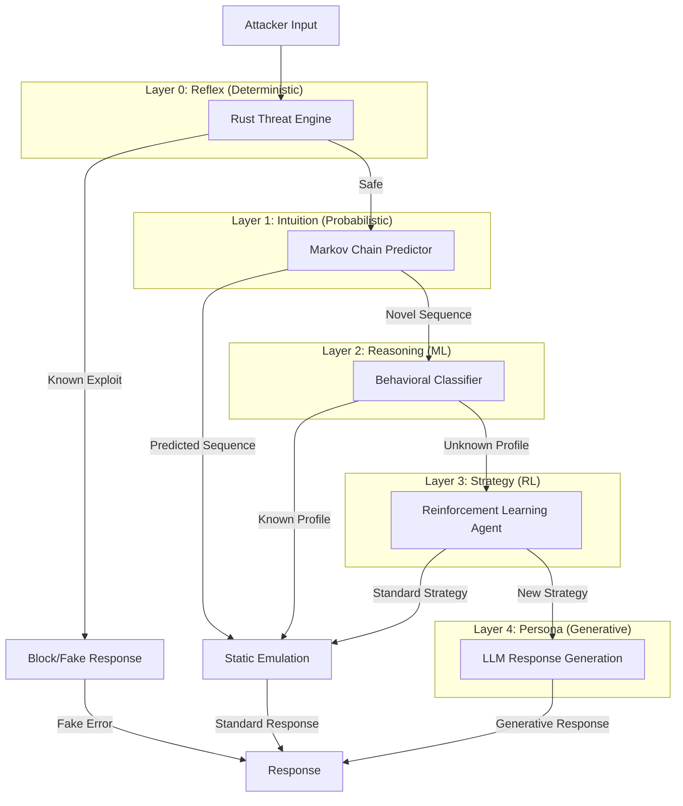

# Project Mirage: Development Roadmap
## Adaptive Honeypot with Cognitive Deception Framework

**Current Project Status**: Apate Core Complete (87%)  
**Target Architecture**: 5-Layer Cognitive Deception System  
**Primary Metric**: Mean Time To Discovery (MTTD)  
**Last Updated**: October 22, 2025

---

## 🎯 Executive Summary

Project Mirage transforms the existing Apate honeypot into an adaptive deception platform using a five-layer cognitive architecture. Current implementation provides the foundation (static honeypot services), while planned phases will add predictive modeling, behavioral classification, reinforcement learning, and generative content capabilities.

**Current Baseline MTTD**: 2-5 minutes (estimated, industry standard static honeypot)  
**Phase 1 Target MTTD**: 15-20 minutes (3-4x improvement with Layers 0-1)  
**Ultimate Goal MTTD**: 45-60+ minutes (with all five layers operational)

---

## 📊 Architecture Overview

```
┌─────────────────────────────────────────────────────────────┐
│ Layer 4: Persona Layer (Generative Content)                 │
│ Language: Python | Status: Planned Q3 2026                  │
│ Function: Context-aware conversational responses            │
└─────────────────────────────────────────────────────────────┘
                              ↓
┌─────────────────────────────────────────────────────────────┐
│ Layer 3: Strategy Layer (Reinforcement Learning)            │
│ Language: Python → Rust | Status: Planned Q2 2026           │
│ Function: Long-term engagement optimization                 │
└─────────────────────────────────────────────────────────────┘
                              ↓
┌─────────────────────────────────────────────────────────────┐
│ Layer 2: Reasoning Layer (Behavioral Classification)        │
│ Language: Python + scikit-learn | Status: Q1 2026           │
│ Function: Attacker profiling and strategy generation        │
└─────────────────────────────────────────────────────────────┘
                              ↓
┌─────────────────────────────────────────────────────────────┐
│ Layer 1: Intuition Layer (Predictive Modeling)              │
│ Language: Python + NumPy | Status: Current Phase            │
│ Function: Real-time command sequence prediction             │
└─────────────────────────────────────────────────────────────┘
                              ↓
┌─────────────────────────────────────────────────────────────┐
│ Layer 0: Reflex Layer (Deterministic Safety)                │
│ Language: Rust | Status: In Progress                        │
│ Function: Sub-millisecond threat containment                │
└─────────────────────────────────────────────────────────────┘
                              ↓
                    [Existing Apate Core]
                   SSH, HTTP, Honeytoken System
```

---

## 🏗️ Current Foundation (✅ Complete - 87%)

### Existing Apate Infrastructure

**What We Have**:
- ✅ FastAPI backend with comprehensive endpoints
- ✅ PostgreSQL database with session/alert/interaction schemas
- ✅ Redis session management
- ✅ SSH emulator with 15+ commands and realistic filesystem
- ✅ HTTP emulator with multiple service templates
- ✅ Honeytoken generation system (credentials, API keys, SSH keys)
- ✅ Docker containerization and CI/CD pipeline
- ✅ Rust TCP protocol library (basic implementation)
- ✅ 53 comprehensive unit tests (100% pass rate)

**What This Provides**:
- Static honeypot baseline for MTTD measurement
- Data collection infrastructure for ML training
- Service emulation foundation for adaptive layers
- Development and deployment automation

**Current Limitations**:
- No predictive behavior modeling
- Fixed response patterns (easily fingerprinted)
- No attacker classification or profiling
- Static engagement strategies
- Limited cross-protocol intelligence

---

## 🚀 Phase 1: Reflex & Intuition Layers (Q4 2025 - Q1 2026)

**Timeline**: 12-16 weeks  
**Goal**: Achieve 15-20 minute MTTD (3-4x improvement)  
**Budget**: <150ms total added latency


**Objective**: Real-time attacker behavior prediction using Markov chains

**Implementation Tasks**:

#### Week 7-8: Mathematical Foundation
- [ ] Implement variable-order Markov chains
  - Order 1: Single command dependency
  - Order 2: Two-command sequence dependency
  - Order 3: Three-command context window
- [ ] Build Probabilistic Suffix Trees (PST)
  - Efficient longest-match algorithm
  - Memory-bounded state storage
  - Incremental tree updates
  - **Zero Frequency Handling**: Implement Kneser-Ney smoothing to handle unseen commands and avoid zero-probability crashes
- [ ] Create Bayesian inference engine
  - Prior probability initialization
  - Likelihood calculation
  - Posterior probability updates

#### Week 9-10: Service-Specific Models
- [ ] SSH command prediction model
  - Common reconnaissance sequences
  - Privilege escalation patterns
  - Lateral movement signatures
- [ ] HTTP request prediction model
  - Brute force attack patterns
  - Directory traversal sequences
  - SQL injection attempts
- [ ] Cross-protocol correlation
  - Session stitching across services
  - Attack campaign detection

#### Week 11-12: Performance Optimization
- [ ] Implement Cython for critical paths
  - NumPy vectorization for matrix operations
  - JIT compilation for probability calculations
- [ ] Add preemptive response caching
  - Top-K likely next commands
  - Probabilistic prefetching
- [ ] Create confidence scoring system
  - Entropy-based prediction quality
  - Threshold tuning for action triggering

#### Week 13-14: Integration & Training
- [ ] Collect baseline attacker data
  - Deploy static honeypot for 2 weeks
  - Gather 10K+ interaction sequences
  - Annotate attack patterns manually
- [ ] Train initial models
  - Split training/validation sets (80/20)
  - Cross-validation for hyperparameters
  - Model serialization and versioning
- [ ] Implement online learning pipeline
  - Incremental model updates
  - Concept drift detection
  - A/B testing framework

**Success Criteria**:
- ✅ >70% next-command prediction accuracy
- ✅ <50ms prediction latency
- ✅ Successful prediction for top 5 command sequences
- ✅ Confidence calibration (predicted probability matches observed frequency)

---

### Phase 1 MTTD Validation

**Testing Methodology**:

1. **Baseline Measurement** (Week 15):
   - Deploy static honeypot (Layer 0 only)
   - Measure MTTD across 50+ attacker sessions
   - Calculate mean, median, std deviation
   - Expected: 2-5 minutes

2. **Adaptive Measurement** (Week 16):
   - Deploy Layer 0+1 integrated system
   - Measure MTTD with same attack profiles
   - Calculate improvement ratio
   - Target: 15-20 minutes (3-4x improvement)

3. **Statistical Validation**:
   - Two-sample t-test for significance (p < 0.05)
   - Kaplan-Meier survival analysis
   - Red team expert validation (human testing)

**Deliverables**:
- [ ] MTTD measurement dashboard (Grafana)
- [ ] Automated adversary simulation scripts
- [ ] Phase 1 technical report with results
- [ ] Model performance metrics and analysis

---

## 🧠 Phase 2: Reasoning Layer (Q1-Q2 2026)

**Timeline**: 10-12 weeks  
**Goal**: Attacker classification and adaptive strategy generation  
**Target Latency**: +100ms (total: <150ms)

### Layer 2: Behavioral Classification System

**Objective**: Real-time attacker profiling and tactical strategy generation

**Implementation Tasks**:

#### Week 1-3: Feature Engineering Pipeline
- [ ] Temporal feature extraction
  - Command velocity (commands/minute)
  - Command acceleration (velocity change rate)
  - Session duration patterns
  - Time-of-day analysis
  - Inter-command timing distribution
- [ ] Semantic feature extraction
  - Command embedding using Word2Vec/BERT
  - Argument similarity analysis
  - Directory traversal depth
  - File access patterns
- [ ] Behavioral graph features
  - **Latency** (0.0-1.0): Response delay characteristics
  - **Breadcrumbing** (0.0-1.0): Cross-service reference density
- [ ] Implement strategy mapping matrix
  - Classification → Strategy vector mapping
  - Confidence-weighted parameter adjustment
  - Multi-objective optimization (MTTD vs. data collection)
- [ ] Build action generation system
  - Honeytoken injection triggers
  - Sudo emulation activation
  - File content modification rules
  - Cross-service breadcrumb placement

#### Week 10-12: Integration & Validation
- [ ] Integrate with Layer 0+1
  - Async strategy directive messages
  - Real-time configuration updates
  - Rollback on misclassification
- [ ] Implement A/B testing framework
  - Strategy effectiveness comparison
  - MTTD impact per strategy dimension
  - Automated parameter tuning
- [ ] Validate classification accuracy
  - Ground truth labeling (red team)
  - Confusion matrix analysis
  - Precision/recall optimization

**Success Criteria**:
- ✅ >80% attacker classification accuracy
- ✅ <100ms feature extraction + classification
- ✅ Measurable MTTD improvement per attacker class
- ✅ Strategy effectiveness correlation >0.6

---

## 🎮 Phase 3: Strategy Layer (Q2-Q3 2026)

**Timeline**: 12-14 weeks  
**Goal**: Long-term engagement optimization via reinforcement learning  
**Migration Path**: Python → Rust for production

### Layer 3: Reinforcement Learning System

**Objective**: Dynamic strategy optimization based on attacker engagement quality

**Implementation Tasks**:

#### Week 1-4: RL Environment Design
- [ ] Define state space
  - Session history embedding
  - Current classification probabilities
  - Strategy vector history
  - MTTD progress indicator
  - Engagement quality score
- [ ] Define action space
  - Continuous strategy vector (4D: enticement, complexity, latency, breadcrumbing)
  - Discrete actions (honeytoken placement, service enabling)
- [ ] Design reward function
  - Primary: MTTD delta (time since last action) - *Note: Challenging to measure exact discovery moment*
  - **Alternative/Proxy Metrics**:
    - Inverse Reinforcement Learning (IRL) to infer reward from expert traces
    - Command Entropy (detecting sudden erratic behavior)
    - Session Length (noisy but available proxy)
  - Secondary: Data collection quality
  - Penalties: Discovery detection, session abandonment
  - Exploration bonuses: Novel attacker behaviors

#### Week 5-8: Algorithm Implementation
- [ ] Implement Proximal Policy Optimization (PPO)
### 1. Total Project Architecture


### 2. Cognitive Deception Layers (Cascading Short-Circuit)

  - Actor-critic architecture
  - Clipped surrogate objective
  - Advantage estimation (GAE)
- [ ] Build experience replay system
  - Prioritized experience replay
  - Memory-efficient circular buffer
  - Off-policy correction
- [ ] Create policy network architecture
  - Input: State embedding (128D)
  - Hidden layers: [256, 256, 128]
  - Output: Strategy vector + value estimate

#### Week 9-11: Training Infrastructure
- [ ] Set up distributed training with Ray/RLlib
  - Parallel environment rollouts
  - Centralized policy updates
  - Hyperparameter tuning with Ray Tune
- [ ] Implement simulation environment
  - Attacker behavior simulator (based on real data)
  - Fast-forward time for training efficiency
  - Diverse attacker profile generation
- [ ] Build evaluation framework
  - Episodic return tracking
  - Policy visualization (t-SNE projections)
  - Strategy evolution analysis

#### Week 12-14: Rust Migration
- [ ] Port inference pipeline to Rust
  - ONNX model export from PyTorch
  - Tract/TensorRT inference
  - Sub-10ms policy evaluation
- [ ] Optimize memory management
  - Fixed-size state buffers
  - Zero-copy tensor operations
- [ ] Production deployment
  - Canary rollout strategy
  - Fallback to Layer 2 on failure
  - Performance monitoring

**Success Criteria**:
- ✅ 20%+ MTTD improvement over Layer 2 baseline
- ✅ Convergence within 1M training steps
- ✅ <10ms inference latency in Rust
- ✅ Stable performance across attacker diversity

---

## 🎭 Phase 4: Persona Layer (Q3-Q4 2026)

**Timeline**: 10-12 weeks  
**Goal**: Context-aware generative responses using LLMs  
**Integration**: Centralized model serving with local caching

### Layer 4: Generative Content System

**Objective**: Natural language interaction for maximum realism

**Implementation Tasks**:

#### Week 1-3: LLM Integration
- [ ] Set up model serving infrastructure
  - FastAPI server for centralized inference
  - OpenAI API integration (fallback)
  - Anthropic Claude API integration (primary)
  - Rate limiting and cost management
- [ ] Implement prompt engineering framework
  - System prompts per attacker classification
  - Few-shot examples for consistency
  - Context window management (sliding window)
- [ ] Build output sanitization pipeline
  - Harmful content filtering
  - Consistency checking (persona adherence)
  - Realistic error injection
  - **Blue Team Verification**: Secondary "Blue Team" LLM to verify "Red Team" output before sending to attacker (mitigate prompt injection)

#### Week 4-6: Response Generation
- [ ] Create persona templates
  - Sysadmin persona (default)
  - Developer persona (code repositories)
  - Security engineer persona (advanced attackers)
  - Novice user persona (low-skill attackers)
- [ ] Implement context management
  - Session history summarization
  - Cross-protocol context stitching
  - Personality consistency enforcement
  - Target: >70% human-like rating
- [ ] MTTD impact analysis
  - Measure Layer 4 contribution
  - Compare with Layer 3 baseline
  - Target: Additional 10-15 minutes MTTD
- [ ] Cost optimization
  - Token usage monitoring
  - Strategic LLM invocation (not every command)
  - Open-source model evaluation

**Success Criteria**:
- ✅ >70% human-like rating in blind evaluation
- ✅ 10-15 minute MTTD increase
- ✅ <100ms average response latency
- ✅ <$50/month operational cost

---

## 📈 MTTD Progression Targets

| Phase | Layers Active | Target MTTD | Improvement Factor | Timeline |
|-------|---------------|-------------|--------------------|----------|
| **Baseline** | Apate Core (Static) | 2-5 min | 1x | Current |
| **Phase 1** | Layer 0+1 | 15-20 min | 3-4x | Q1 2026 |
| **Phase 2** | Layer 0+1+2 | 25-35 min | 5-7x | Q2 2026 |
| **Phase 3** | Layer 0+1+2+3 | 35-50 min | 7-10x | Q3 2026 |
| **Phase 4** | All Five Layers | 45-60+ min | 9-12x | Q4 2026 |

---

## 🔧 Supporting Infrastructure Development

### Parallel Track: Monitoring & Operations (Ongoing)

**Q4 2025 - Q1 2026**:
- [ ] Prometheus metrics for all layers
  - Latency histograms per layer
  - MTTD tracking per session
  - Classification accuracy over time
  - Model prediction confidence distributions
- [ ] Grafana dashboards
  - Real-time MTTD visualization
  - Layer performance breakdown
  - Attacker classification distribution
  - Strategy effectiveness heatmaps
- [ ] ELK stack for log aggregation
  - Centralized logging from all services
  - Full-text search for incident response
  - Anomaly detection on log patterns

**Q2 2026**:
- [ ] Alerting infrastructure
  - PagerDuty integration for critical failures
  - Slack notifications for MTTD milestones
  - Automated remediation for common issues
- [ ] Capacity planning
  - Traffic forecasting models
  - Resource utilization optimization
  - Auto-scaling policies

### Parallel Track: Data Collection & ML Ops (Ongoing)

**Q4 2025**:
- [ ] Data pipeline for model training
  - Automated data labeling (weak supervision)
  - Feature store implementation
  - Versioned dataset management
- [ ] MLflow for experiment tracking
  - Model hyperparameter logging
  - Performance metric comparison
  - Model registry and versioning

**Q1-Q2 2026**:
- [ ] Continuous training pipeline
  - Weekly model retraining
  - Automated evaluation and promotion
  - Drift detection and alerting
- [ ] A/B testing platform
  - Multi-armed bandit for strategy selection
  - Statistical significance testing
  - Automated winner promotion

---

## 🎯 Success Metrics & KPIs

### Primary Metrics

| Metric | Current | Phase 1 Target | Phase 4 Target |
|--------|---------|----------------|----------------|
| **MTTD (Mean)** | 3 min | 17 min | 52 min |
| **MTTD (Median)** | 2.5 min | 15 min | 48 min |
| **MTTD (95th percentile)** | 5 min | 25 min | 70 min |
| **Attacker Engagement Rate** | 40% | 65% | 85% |
| **Data Collection Quality** | Low | Medium | High |

### Technical Performance Metrics

| Metric | Target | Measurement Method |
|--------|--------|-------------------|
| **Layer 0 Latency** | <1ms | P99 response time |
| **Layer 1 Latency** | <50ms | Prediction generation time |
| **Layer 2 Latency** | <100ms | Classification + strategy time |
| **Layer 3 Latency** | <10ms | RL policy evaluation |
| **Layer 4 Latency** | <100ms | LLM response generation (cached) |
| **Total Pipeline Latency** | <200ms | End-to-end (P99) |
| **System Uptime** | >99.9% | Monthly availability |

### Machine Learning Metrics

| Model | Metric | Target |
|-------|--------|--------|
| **Layer 1 (Markov)** | Next-command accuracy | >70% |
| **Layer 2 (Classifier)** | F1-score | >0.80 |
| **Layer 3 (RL)** | Average episodic return | >100 |
| **Layer 4 (LLM)** | Human-like rating | >70% |

---

## 🚧 Risk Management

### Technical Risks

| Risk | Probability | Impact | Mitigation |
|------|-------------|--------|------------|
| **Rust-Python integration issues** | Medium | High | Extensive FFI testing, fallback to pure Python |
| **ML model overfitting** | Medium | Medium | Cross-validation, regularization, diverse training data |
| **LLM API cost overrun** | High | Medium | Caching, local models, strategic invocation |
| **Latency budget exceeded** | Low | High | Performance profiling, async architecture, circuit breakers |
| **Data quality issues** | Medium | High | Automated validation, manual labeling, data augmentation |

### Operational Risks

| Risk | Probability | Impact | Mitigation |
|------|-------------|--------|------------|
| **Production deployment failure** | Low | High | Canary releases, blue-green deployment, rollback automation |
| **Monitoring gaps** | Medium | Medium | Comprehensive metric coverage, alerting thresholds |
| **Resource exhaustion** | Medium | High | Rate limiting, auto-scaling, resource quotas |
| **Model drift** | High | Medium | Continuous monitoring, automated retraining, drift detection |

---

## 📚 Documentation Requirements

### Phase 1 Deliverables
- [ ] Rust API documentation (rustdoc)
- [ ] Layer 0+1 integration guide
- [ ] MTTD measurement methodology
- [ ] Performance benchmarking report

### Phase 2 Deliverables
- [ ] Feature engineering specification
- [ ] Classification model documentation
- [ ] Strategy generation playbook
- [ ] A/B testing framework guide

### Phase 3 Deliverables
- [ ] RL environment specification
- [ ] Training procedure documentation
- [ ] Rust inference optimization guide
- [ ] Policy evaluation methodology

### Phase 4 Deliverables
- [ ] LLM integration guide
- [ ] Prompt engineering handbook
- [ ] Cost optimization strategies
- [ ] End-to-end system architecture

---

## 🎓 Team & Resources

### Required Expertise

| Role | Phase 1 | Phase 2 | Phase 3 | Phase 4 |
|------|---------|---------|---------|---------|
| **Rust Developer** | 1 FTE | 0.5 FTE | 1 FTE | 0.5 FTE |
| **Python/ML Engineer** | 1 FTE | 1 FTE | 1 FTE | 0.5 FTE |
| **Data Scientist** | 0.5 FTE | 1 FTE | 1 FTE | 0.5 FTE |
| **DevOps Engineer** | 0.5 FTE | 0.5 FTE | 0.5 FTE | 0.5 FTE |
| **Security Researcher** | 0.25 FTE | 0.25 FTE | 0.25 FTE | 0.25 FTE |

### Infrastructure Requirements

- **Compute**: 4-8 core CPU, 16-32GB RAM (development)
- **GPU**: NVIDIA T4/A10 (model training)
- **Storage**: 500GB SSD (data + models)
- **Cloud**: AWS/GCP for production deployment
- **Budget**: ~$500-1000/month (infrastructure + APIs)

---

## 📅 Milestone Summary

| Quarter | Key Deliverable | MTTD Target | Status |
|---------|-----------------|-------------|--------|
| **Q4 2025** | Layer 0 (Rust Reflex) | 5-8 min | 🔄 In Progress |
| **Q1 2026** | Layer 1 (Markov Intuition) | 15-20 min | ⏳ Planned |
| **Q2 2026** | Layer 2 (Classification) | 25-35 min | ⏳ Planned |
| **Q3 2026** | Layer 3 (RL Strategy) | 35-50 min | ⏳ Planned |
| **Q4 2026** | Layer 4 (LLM Persona) | 45-60+ min | ⏳ Planned |

---

## 🎉 Phase Completion Criteria

### Phase 1 Complete When:
- ✅ Layer 0 Rust implementation passes all performance benchmarks
- ✅ Layer 1 achieves >70% next-command prediction accuracy
- ✅ MTTD improves to 15-20 minutes (statistically significant)
- ✅ System remains stable under 10K concurrent connections
- ✅ Full test coverage (unit + integration)

### Phase 2 Complete When:
- ✅ Attacker classification achieves >80% F1-score
- ✅ Strategy generation correlates with MTTD improvement (r>0.6)
- ✅ MTTD reaches 25-35 minutes
- ✅ A/B testing framework operational
- ✅ Incremental learning pipeline automated

### Phase 3 Complete When:
- ✅ RL agent converges (stable policy)
- ✅ 20%+ MTTD improvement over Layer 2
- ✅ Rust inference <10ms latency
- ✅ Production deployment successful
- ✅ Cost per session <$0.10

### Phase 4 Complete When:
- ✅ LLM responses pass 70% Turing test
- ✅ MTTD reaches 45-60+ minutes
- ✅ Total system latency <200ms (P99)
- ✅ Monthly operational cost <$500
- ✅ All five layers integrated and tested

---

*This roadmap is a living document. Updates will be made as phases complete and new insights emerge from implementation.*

**Next Review**: January 15, 2026  
**Version**: 1.0  
**Last Updated**: October 22, 2025