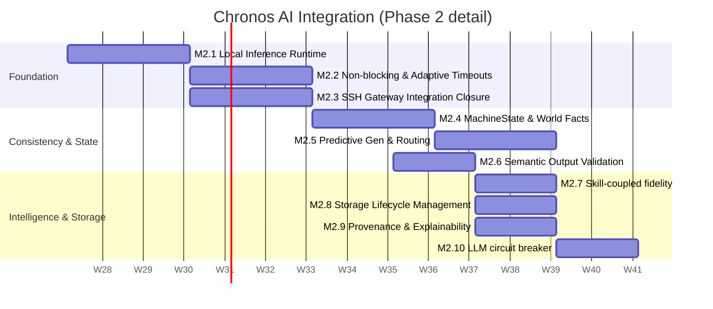

# Chronos AI Integration Roadmap

**Scope:** Phase 2 of Mirage/Chronos — AI integration that improves realism and
analyst value without introducing unnecessary complexity or compromising the
state-consistency guarantees established in Phase 1.

**Governing principle (from `docs/ROADMAP.md`):** AI must complement
deterministic behavior. It never owns state truth, never mutates the atomic
write path, and must degrade gracefully to deterministic fallbacks when
unavailable, slow, or low-confidence.

**Related documents:**
- `AI_ARCHITECTURE.md` — components, data flow, deployment topology
- `AI_LOGIC.md` — algorithms, decision rules, pseudocode

---

## 0. Current State (Baseline)

| Component | File | Status |
|---|---|---|
| `LLMProvider` ABC | `src/chronos/intelligence/llm.py` | Over-abstracted (Mock / OpenAI / Anthropic implemented) |
| `PersonaEngine` | `src/chronos/intelligence/persona.py` | Hardcoded persona dict, no session memory |
| Lazy generation | `src/chronos/interface/fuse.py::read()` | Synchronous, blocking, no timeout |
| Skill/risk scoring | `src/chronos/skills/skill_detector.py` | Computed but not fed back into generation |
| SSH command execution | `src/chronos/gateway/ssh_server.py::_execute_command()` | Static stub, **not routed through FUSE** |

This baseline is functionally correct but has structural gaps that Phase 2
must close: no config-driven personas, lack of a coherent `MachineState`,
no output validation against that state, no latency/failure handling, and
no cost/fidelity coupling to attacker skill level.

---

## 1. Guardrails (must hold across every milestone)

These are non-negotiable constraints carried over from Phase 1, restated for
the AI workstream specifically:

1. **State truth never comes from AI.** Filesystem existence, permissions,
   directory structure, and session state remain 100% Redis/Lua. AI only
   produces file *content*, once, then it's frozen into the blob store.
2. **No AI call blocks a syscall indefinitely.** Every generation path has a
   hard timeout and a deterministic fallback (see `AI_LOGIC.md §2`).
3. **All generated content is provenance-tagged.** Every blob has metadata
   recording which persona, model, parameters, and prompt version produced it.
4. **AI fallback path must never look like an AI fallback.** Timeouts,
   failures, and stubs return POSIX-realistic errors/content, not "AI is
   unavailable" style messages.
5. **No AI-authored PR merges without an explainability + regression check**
   (per Workstream 4 in `docs/ROADMAP.md`).

---

## 2. Milestones

### M2.1 — Persona Configuration & Local Inference Runtime (Weeks 1–3)

**Goal:** Get personas out of code and simplify to a robust, air-gapped local inference runtime.

- [ ] Externalize `PersonaEngine._load_personas()` into `config/personas/*.yaml`
- [ ] Replace `LLMProvider` abstractions with a unified `Inference Runtime` targeting Ollama.
- [ ] Add `ollama` service to `docker-compose.yml` / `docker-compose.prod.yml`
      on `chronos-net` (no public egress required, removing cloud APIs).
- [ ] Implement `Model Router` to route tasks to different local models (e.g., small models for configs, larger for SQL dumps).
- [ ] Keep frequently used models resident in memory to eliminate load delays.

**Exit criteria:** Personas editable via YAML; all inference routed locally through Ollama with task-specific model routing; zero regressions in `verify_phase3.py`.

---

### M2.2 — Non-Blocking Generation Path & Adaptive Timeouts (Weeks 3–6)

**Goal:** Remove the synchronous LLM call from the FUSE `read()` hot path and handle varying model latencies.

- [ ] Implement background generation pool + Redis-backed dedup lock
- [ ] Implement **Adaptive Timeouts** (P95 latency + safety margin) instead of a fixed 5s limit.
- [ ] Add per-session inference budgets (quotas) to prevent resource exhaustion from mass-file reads (e.g., `find /`).
- [ ] Background generation continues after timeout and persists on completion.
- [ ] Add generation latency histogram to Prometheus.

**Exit criteria:** `read()` on a cache-miss never blocks longer than the adaptive timeout; retried reads after a timeout return correct cached content; inference quotas enforced.

---

### M2.3 — SSH Gateway Integration Closure (Weeks 5–8, overlaps M2.2)

**Goal:** Route SSH shell commands through FUSE so the primary attack surface exercises the AI pipeline immediately.

- [ ] Route SSH shell commands through `ChronosFUSE` instead of the hardcoded `if/elif` stub.
- [ ] Re-run `test_real_attack.py` and `demo_standalone.py` against the SSH path.
- [ ] Confirm timeout/fallback (M2.2) behave identically over an SSH session as over a local mount.

**Exit criteria:** A full SSH session exercises the entire AI pipeline, validating the core loop before adding further complexity.

---

### M2.4 — MachineState & Relational World Facts (Weeks 6–9)

**Goal:** Eliminate cross-file contradiction by introducing a canonical `MachineState` (Knowledge Graph).

- [ ] Replace flat session facts with a relational `MachineState` object (Installed Packages, Running Services, Kernel, Hostname, Users, Ports, Cron Jobs).
- [ ] Thread `MachineState` into every `generate_content()` call via a **Prompt Builder** to optimize context window budgets.
- [ ] Add a regression test that generates multiple dependent files (e.g., Apache config, ports, logs) and asserts they agree with the `MachineState`.

**Exit criteria:** Ghost files generated in the same session never disagree on injected world facts.

---

### M2.5 — Predictive Generation & Task Routing (Weeks 8–11)

**Goal:** Shift generation earlier so attackers rarely observe a cache-miss, while prioritizing high-value reads.

- [ ] Trigger background generation on `create()`.
- [ ] Trigger prewarming for up to N un-generated children on `readdir()`.
- [ ] Optimize prewarming based on **Likely Reads** and **Frequently Accessed** files instead of simple FIFO.
- [ ] Add prewarm hit-rate metric.

**Exit criteria:** Prewarm hit-rate tracked in Grafana; priority-based prewarming prevents compute waste on huge directories.

---

### M2.6 — Semantic Output Validation / Anti-Slop Gate (Weeks 9–11)

**Goal:** Reject generated content that doesn't semantically align with the system's `MachineState`.

- [ ] Define per-content-type validators that cross-reference against `MachineState` (e.g., Apache config must reference existing modules).
- [ ] Reject → retry once → fall back to static template on second failure.
- [ ] Log validation failures with reason.

**Exit criteria:** Validation gate active on 100% of generation paths with semantic checks passing/failing appropriately.

---

### M2.7 — Skill-Coupled Fidelity (Weeks 10–12)

**Goal:** Feed `SkillDetector` output back into generation decisions.

- [ ] Define fidelity tiers mapped to skill level thresholds.
- [ ] Escalate tier as technique diversity / risk score crosses thresholds (never backward).

**Exit criteria:** Fidelity tier visible per session in audit logs; A/B comparison of inference cost between tiered and untiered generation.

---

### M2.8 — Storage Lifecycle Management (Weeks 11–13)

**Goal:** Prevent unbounded storage growth from millions of generated blobs.

- [ ] Implement storage tiers: Hot (memory/cache) → Warm (Redis) → Cold (Disk) → Archive → Delete.
- [ ] Automatically age-out and transition blobs based on access patterns and session expiration.
- [ ] Separate Versioning for Dynamic Files (logs, histories) vs. static configs.

**Exit criteria:** Storage usage remains bounded over long-running deployments.

---

### M2.9 — Provenance & Explainability (Weeks 12–14)

**Goal:** Every generated blob is auditable for consistent regeneration.

- [ ] Add `fs:blob_meta:<hash>` hash: persona, model, prompt, seed, generation parameters (temp, top p), generated_at, fidelity tier.
- [ ] Surface provenance in `AuditLogStreamer` events.

**Exit criteria:** Full generation parameters are retrievable for consistent offline regeneration.

---

### M2.10 — Resilience: LLM Circuit Breaker (Weeks 13–15)

**Goal:** Degrade gracefully under inference load.

- [ ] Track LLM latency/failure rate.
- [ ] On repeated failures, auto-degrade to static templates.
- [ ] Time-based backoff recovery.

**Exit criteria:** Simulated provider outage results in functional generation with no FUSE-level errors.

---

## 3. Delivery Timeline

---

## 4. Metrics to Track (extends `docs/ROADMAP.md §Metrics`)

| Metric | Source | Target |
|---|---|---|
| Generation timeout rate | M2.2 | < 5% of cache-misses under normal load |
| Inference Quota Hits | M2.2 | Track sessions hitting limit |
| SSH-path AI parity | M2.3 | 100% of FUSE test cases pass over SSH |
| Fact-contradiction incidents | M2.4 regression test | 0 |
| Prewarm hit-rate | M2.5 | > 60% of reads served pre-generated |
| Semantic Rejection Rate | M2.6 | Tracked (signal of bad MachineState alignment) |
| Provenance coverage | M2.9 | 100% of generated blobs |
| Storage eviction rate | M2.8 | Equal to ingestion rate at capacity |

---

## 5. Open Decisions (need a call before M2.1 starts)

1. **Ollama hosting**: shared GPU host vs. CPU-only container? This impacts the baseline for adaptive timeouts.
2. **Cold Storage DB**: Confirm implementation detail for the Storage Lifecycle (M2.8) — e.g. PostgreSQL vs local disk.
3. **Validation gate strictness (M2.6)**: hard reject-and-template-fallback, or log-and-serve-anyway with a lower confidence flag? 
4. **MachineState Complexity**: How deep should the relational graph go in M2.4 before we consider it "complete"?

---

*This roadmap extends, and does not replace, `docs/ROADMAP.md`. Any change
here should be reflected there if it affects Phase 2 exit criteria.*
