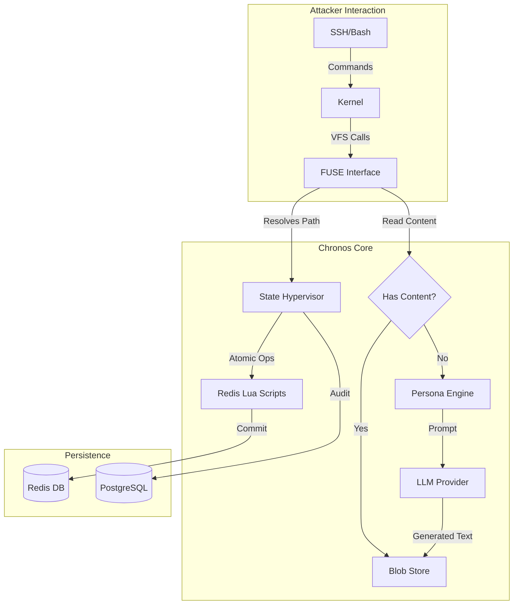

# Chronos Framework Architecture

> **Technical Specification**: Version 1.0 (Feb 2026)

This document provides a deep dive into the internal architecture of the Chronos Framework. It details the interaction between the **FUSE Interface**, **State Hypervisor**, and **Cognitive Intelligence** layers.

**For a comprehensive analysis of the state hallucination problem and how Chronos solves it**, see [Problem Analysis](PROBLEM_ANALYSIS.md).

---

## 🏗️ System Components

The architecture follows a strict separation of concerns:

1.  **Interface Layer (FUSE)**: The "skin" of the honeypot. Purely reactive.
2.  **Core Layer (Hypervisor)**: The "brain". Enforces logic and consistency.
3.  **Data Layer (Persistence)**: The "memory". Atomic storage and audit logs.
4.  **Intelligence Layer (Cognitive)**: The "imagination". Generates content on demand.



---

## 1. The State Hypervisor

The **State Hypervisor** (`src/chronos/core/state.py`) is the guardian of consistency. It abstracts low-level Redis operations into high-level filesystem verbs (`create_file`, `link`, `mkdir`).

### The "Hallucination" Problem

**Traditional honeypots** (Honeyd, Cowrie) suffer from:
- Limited interaction (only scripted commands work)
- State inconsistency (create file → disappears on ls)
- Easily detectable by attackers

**LLM-based honeypots** suffer from:
- **Memory window limits**: After N commands, LLM forgets earlier actions
- **State contradictions**: `cd /home` then later `pwd` returns `/root` (hallucination)
- **Permission inconsistencies**: `whoami` returns `root` but `touch /root/file` fails
- **No persistent state tracking**: Each response independently generated

**Chronos solves this by**:
1. Using FUSE to implement a real POSIX filesystem
2. Using Redis to atomically persist ALL state changes
3. Using LLMs ONLY for content generation (NOT state management)
4. Using Lua scripts to ensure atomic transactions

**Example**:
```
Attacker: touch /tmp/pwn && cd /tmp && ls
Chronos:
1. FUSE intercepts syscalls
2. State Hypervisor creates inode in Redis (ATOMIC)
3. LLM never involved in state (only in file content if needed)
4. ls reads directly from Redis
→ File guaranteed to be there (no hallucination)
```

### Redis Data Schema
We use a hybrid schema optimized for O(1) lookups and atomic updates.

| Key | Type | Purpose | Example |
|-----|------|---------|---------|
| `fs:inode:<id>` | **Hash** | POSIX Metadata | `{mode: 33188, uid: 0, size: 1024}` |
| `fs:dir:<id>` | **Sorted Set** | Directory Entries | `Score: <inode>`, `Member: <filename>` |
| `fs:blob:<hash>` | **String** | File Content (CAS) | `sha256_hash` -> `binary_content` |
| `fs:next_inode` | **Counter** | Atomic Allocator | `1024` |

### Atomic Operations (Lua)
To prevent race conditions (e.g., two attackers creating the same file simultaneously), we use Redis Lua scripts. These execute atomically on the Redis server.

**Example: `atomic_create.lua` logic**
1.  Check `fs:dir:<parent>` for filename existence. (Abort if exists)
2.  `INCR fs:next_inode` -> Get new ID.
3.  `HSET fs:inode:<new_id>` -> Set default metadata (0644, root:root).
4.  `ZADD fs:dir:<parent>` -> Link new inode to parent directory.
5.  All happens in a single transaction block.

---

## 2. FUSE Interface Implementation

Chronos implements a userspace filesystem using `fusepy`. This allows us to intercept system calls at the kernel boundary.

### Syscall Mapping

| POSIX Syscall | FUSE Method | Chronos Action |
|---------------|-------------|----------------|
| `getattr(path)` | `getattr` | Resolve path -> `HGETALL fs:inode:<id>` |
| `readdir(path)` | `readdir` | Resolve path -> `ZRANGE fs:dir:<id>` |
| `open(path)` | `open` | Allocate File Descriptor (FD) in memory map |
| `read(fd)` | `read` | Get Inode from FD -> Get Content Hash -> `GET fs:blob:<hash>` |
| `write(fd)` | `write` | update buffer -> Calc SHA256 -> `SET fs:blob:<new>` -> Update Inode |

### Path Resolution
Since Redis is a flat key-value store, we must simulate hierarchy.
*   **Resolution**: Recursive lookup.
    *   Path: `/etc/passwd`
    *   Root Inode: `1`
    *   `ZSCORE fs:dir:1 "etc"` -> Returns Inode `2`
    *   `ZSCORE fs:dir:2 "passwd"` -> Returns Inode `3`
    *   Return Inode `3`.

---

## 3. Cognitive Intelligence (Lazy Generation)

Chronos introduces "Lazy Generation" to populate the filesystem dynamically.

### Workflow
1.  **Attacker**: `cat /etc/secret_config.conf`
2.  **FUSE**: Resolves path to Inode `X`.
3.  **Core**: Checks Inode `X`.
    *   `content_hash`: `NULL` (Ghost File)
4.  **Persona Engine**:
    *   Builds Context: `{"filename": "secret_config.conf", "path": "/etc", "persona": "Database Server"}`
    *   Prompts LLM: *"You are a Database Server. Generate a realistic config file for..."*
5.  **LLM**: Returns valid configuration text.
6.  **Core**:
    *   Saves text to `fs:blob:<new_hash>`
    *   Updates Inode `X` with `content_hash`
    *   **Crucial**: The file is now "solid". Subsequent reads come from Redis, not LLM.
7.  **FUSE**: Returns content to attacker.

This ensures **consistency** (the file doesn't change next time) and **infinite depth** (any file can exist).

---

## 4. Layer 0 Integration (Rust)

While the Python/FUSE layer handles logic, high-volume traffic analysis happens in Rust (`src/chronos/layer0`).

*   **Role**: Pre-flight analysis of payloads.
*   **Mechanism**:
    *   Protocol Buffering
    *   Regex/Heuristic matching for standard exploits (SQLi, XSS, Command Injection)
    *   Feeds directly into the Risk Engine (Future Phase).

---

## 5. Security & Isolation

### Containerization
Chronos runs inside a Docker container with specific capabilities:
*   `CAP_SYS_ADMIN`: Required for FUSE mount.
*   `/dev/fuse`: Device mapping.

### Isolation Strategy
*   **Network**: The honeypot runs on an isolated Docker network (`chronos-net`).
*   **Persistence**: Redis/Postgres verify the only "state" that persists. Destroying the `core-engine` container resets the interface but preserves the data logic if volumes are kept.

---

## 6. Future Roadmap

1.  **Network Topology Simulation**: Simulating multiple hosts (lateral movement targets).
2.  **Active Countermeasures**: Slowing down `read()` calls based on Attacker Risk Score.
3.  **Visual Dashboard**: Web UI for the PostgreSQL audit logs.
