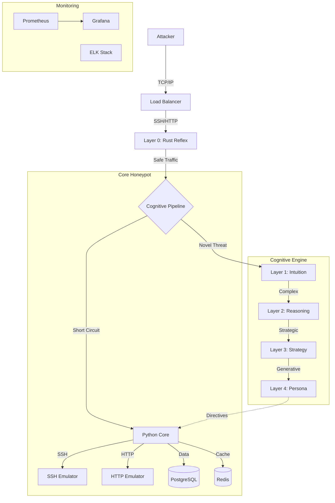
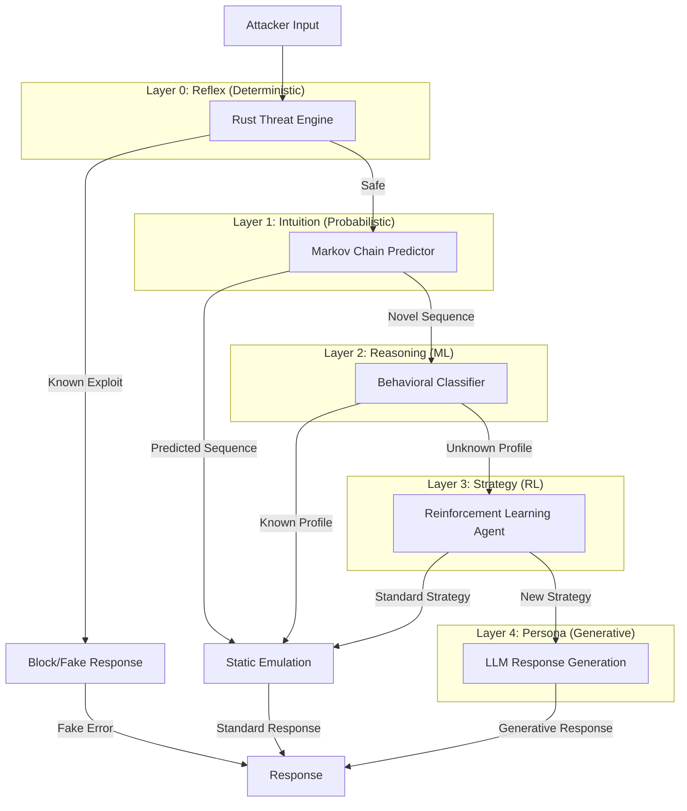
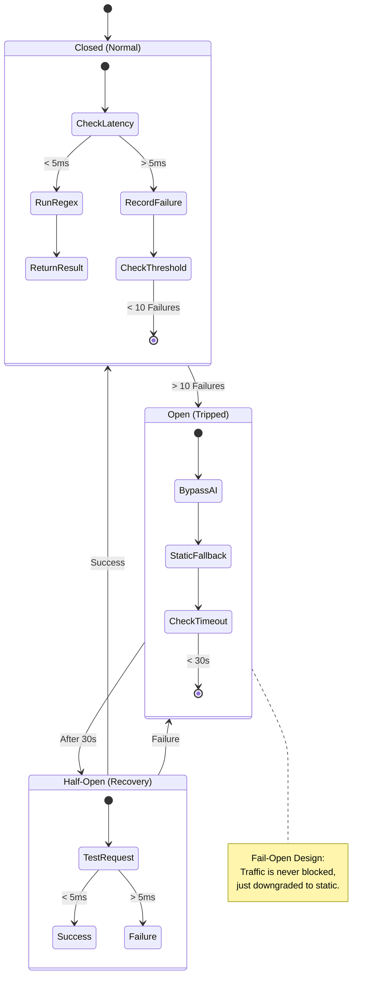

# Project Mirage Roadmap

## 🗺️ Strategic Overview

Project Mirage aims to transform the Apate honeypot into a sophisticated **Cognitive Deception Framework**. This roadmap outlines the architectural evolution, key milestones, and security mechanisms designed to achieve a 9-12x improvement in Mean Time To Discovery (MTTD).

---

## 🏗️ 1. Project Architecture

The following diagram illustrates the high-level architecture of the complete system, integrating the Rust Reflex Layer, Python Core, and the Cognitive Engine.

---

## 🧠 2. AI Cognitive Engine

The core of Mirage is the 5-Layer Cognitive Architecture. This diagram details the flow of data and decision-making through the AI layers.

### Cognitive Deception Layers (Cascading Short-Circuit)

To minimize latency, the system uses a **Cascading Short-Circuit** architecture. At each layer, the system evaluates if it has enough information to respond. If yes, it "exits" to the static emulator immediately. Only novel or complex interactions proceed to higher layers.

---

## 🛡️ 3. Security & Fail-Safe Mechanisms

To ensure stability and low latency, Layer 0 implements a **Latency Circuit Breaker**. This state machine ensures the system fails open under load.

---

## 📅 Execution Timeline

### **Phase 1: Foundation & Reflex (Q4 2025)**
*   **Goal**: Establish Rust infrastructure and sub-millisecond threat detection.
*   **Status**: ✅ **Complete**
*   **Key Deliverables**:
    *   Rust Protocol Library
    *   Threat Detection Engine (Regex)
    *   Latency Circuit Breaker
    *   FFI Safety Wrappers

### **Phase 2: Intuition & Reasoning (Q1-Q2 2026)**
*   **Goal**: Implement predictive modeling and attacker classification.
*   **Status**: 🔄 **In Progress**
*   **Key Deliverables**:
    *   Hidden Markov Models (Layer 1)
    *   Probabilistic Suffix Trees
    *   Random Forest Classifier (Layer 2)
    *   Feature Engineering Pipeline

### **Phase 3: Strategy & Persona (Q3-Q4 2026)**
*   **Goal**: Achieve autonomous strategy optimization and realistic persona generation.
*   **Status**: ⏳ **Planned**
*   **Key Deliverables**:
    *   PPO Reinforcement Learning Agent (Layer 3)
    *   LLM Integration (Layer 4)
    *   Context-Aware Response Generation
    *   Multi-Agent Orchestration

## 🎯 Success Metrics

| Metric | Baseline | Target |
|--------|----------|--------|
| **Mean Time To Discovery (MTTD)** | 2-5 min | **45-60+ min** |
| **System Latency (P99)** | < 1ms | **< 200ms** |
| **Attacker Engagement** | Low | **High** |
