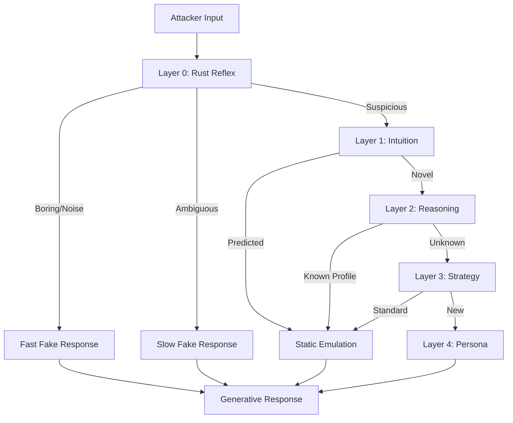

# Project Mirage Roadmap

**Status**: Phase 1 (Foundation) Complete. Phase 2 (Reasoning) In Progress.
**Last Updated**: Jan 2026

---

## 🗺️ Strategic Overview

Project Mirage transforms the Apate honeypot into a **Cognitive Deception Framework**. Unlike traditional honeypots that are static, Mirage uses a 5-layer AI stack to adapt to attackers in real-time, aiming to increase Mean Time To Discovery (MTTD) from minutes to hours.

**Core Thesis**: We build a "Short Circuit" architecture. Only novel, complex threats reach the expensive AI layers. 80% of traffic is handled by cheap, deterministic Rust code (Layer 0).

---

## 📈 MTTD Progression Targets

| Phase | Layers Active | Target MTTD | Status | Timeline |
|-------|---------------|-------------|--------|----------|
| **Baseline** | Apate Core (Static) | 2-5 min | ✅ Complete | Q4 2025 |
| **Phase 1** | Layer 0+1 | 15-20 min | ✅ Complete (Passive) | Q1 2026 |
| **Phase 2** | Layer 0+1+2 | 25-35 min | 🔄 In Progress | Q2 2026 |
| **Phase 3** | Layer 0+1+2+3 | 35-50 min | ⏳ Planned | Q3 2026 |
| **Phase 4** | All Five Layers | 45-60+ min | ⏳ Planned | Q4 2026 |

---

## 🏗️ Technical Roadmap

### ✅ Phase 1: Foundation & Reflex (Completed Q4 2025)

**Goal**: Sub-millisecond threat detection and stable infrastructure.

- **Layer 0 (Rust Reflex)**:
    - [x] Deterministic 3-Lane Router (FastFake, SlowFake, Mirror)
    - [x] Adaptive Circuit Breaker (Fail-open under load)
    - [x] Protocol Classification (SSH, HTTP)
- **Layer 1 (Intuition)**:
    - [x] Hidden Markov Models (HMM) for command prediction
    - [x] Probabilistic Suffix Trees (PST)
    - [x] Passive prediction mode (Advisory only)

### 🔄 Phase 2: Reasoning & Safety (Current - Q1/Q2 2026)

**Goal**: Attacker classification and safe autonomous response.

- **Layer 2 (Reasoning)**:
    - [ ] Behavioral Classification (Random Forest)
    - [ ] Feature Extraction (Time-series, semantic)
    - [ ] Attacker Profiling (Script Kiddie vs APT)
- **Safety Guardrails**:
    - [ ] Activate `privacy.py` (Local-first telemetry)
    - [ ] Deploy `household_safety.py` (Appliance constraints)

### ⏳ Phase 3: Strategy & Autonomy (Planned Q3 2026)

**Goal**: Long-term engagement via Reinforcement Learning.

- **Layer 3 (Strategy)**:
    - [ ] PPO Agent for engagement optimization
    - [ ] Dynamic Strategy Vectors (Latency, Complexity, Enticement)
    - [ ] Rust migration for inference (<10ms)

### ⏳ Phase 4: Persona & Generative (Planned Q4 2026)

**Goal**: Natural language interaction.

- **Layer 4 (Persona)**:
    - [ ] LLM Integration (Context-aware responses)
    - [ ] Semantic Caching (Vector DB)
    - [ ] Multi-Persona Templates (Sysadmin, Dev, etc.)

---

## 📦 Product Roadmap

### 1. Apate Home (Household/SMB)

**Promise**: "Plug-and-play network observer."

- **Tier 1 (Passive)**: Read-only port mirror. Safe.
- **Tier 2 (Proxy)**: Inline with circuit breaker.
- **Privacy**: 100% local processing. No cloud dependency.

### 2. Apate Guard (Enterprise)

**Promise**: "Find APTs before EDR."

- **Deployment**: On-prem or Hybrid Cloud.
- **Integration**: SIEM (Splunk/ELK) pipelines.
- **Feature**: Autonomous response for known patterns (Brute force, Scanners).

---

## 🧠 Cognitive Architecture (The "Short Circuit")

