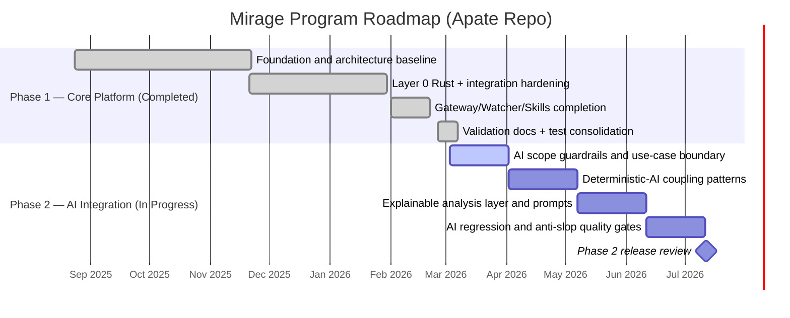
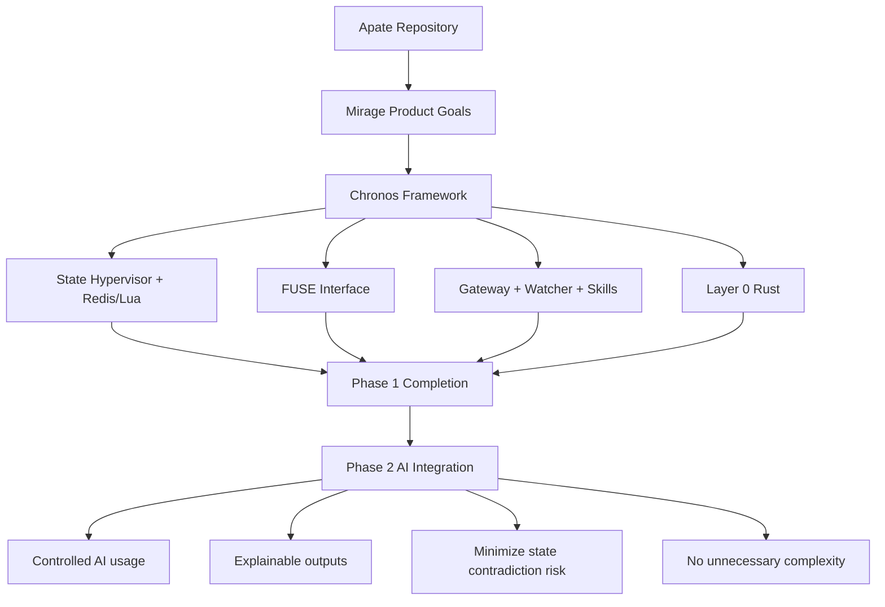

# Mirage Roadmap (Apate Repository)

This roadmap defines the delivery plan for **Mirage** (product idea) implemented via the **Chronos** framework in the **Apate** repository.

## Naming Rules

- Repository codename: **Apate**
- Product/idea name: **Mirage**
- Framework/engine name: **Chronos**

## Program Structure

Mirage is delivered in two 6-month phases:

- **Phase 1 (6 months): Core platform engineering + validation** — **Completed**
- **Phase 2 (6 months): AI integration for analyst value without complexity** — **In Progress**

## Roadmap Focus (From Now Onward)

The remainder of this document is action-oriented and focused on **what to build next**. Historical content is retained only as context for planning and risk control.

---

## Evidence Base Used for This Roadmap

This roadmap is grounded in repository state and commit history, not speculative targets.

### Commit-Derived Milestones (Selected)

| Date | Commit | Milestone Evidence |
|------|--------|--------------------|
| 2025-08-24 | `a2fce5e`, `a9b7dca` | Initial structure and core files in Apate |
| 2025-11-21 | `30ca497`, `bba4434` | Python FFI + hybrid Rust/Python architecture documented |
| 2025-11-25 | `8938ae3`, `90eb90e` | Circuit breaker + Layer 0 threat detection integration |
| 2025-12-21 | `e8066ce`, `7e6571b` | Layer 0/1 integration and scoring/correlation work |
| 2026-02-09 | `071682e`, `e7168e6` | Production compose, monitoring, Phase 4 (gateway/watcher/skills) |
| 2026-02-25 | `0820809` | Phase 1 validation docs and scripts |
| 2026-03-02 | `6180396` | Validation targets, docs updates, test reorganization |

### Current Verified Baseline

From repository docs and tests as of March 2026:

- Core state engine + atomic Redis/Lua operations
- FUSE interface and filesystem simulation
- SSH/HTTP gateways
- Skills stack (command analyzer, threat library, skill detector)
- Watcher stack (event processor, log streamer)
- Layer 0 Rust performance subsystem
- Validation coverage including core checks and attack simulation

---

## Delivery Timeline (Mermaid)

```mermaid
gantt
    title Mirage Program Roadmap (Apate Repo)
    dateFormat  YYYY-MM-DD
    axisFormat  %b %Y

    section Phase 1 — Core Platform (Completed)
    Foundation and architecture baseline          :done, p1a, 2025-08-24, 90d
    Layer 0 Rust + integration hardening          :done, p1b, 2025-11-21, 70d
    Gateway/Watcher/Skills completion             :done, p1c, 2026-02-01, 20d
    Validation docs + test consolidation           :done, p1d, 2026-02-25, 10d

    section Phase 2 — AI Integration (In Progress)
    AI scope guardrails and use-case boundary      :active, p2a, 2026-03-03, 30d
    Deterministic-AI coupling patterns             :p2b, after p2a, 35d
    Explainable analysis layer and prompts         :p2c, after p2b, 35d
    AI regression and anti-slop quality gates      :p2d, after p2c, 30d
    Phase 2 release review                         :milestone, p2e, after p2d, 1d
```

  **Figure R1.** Mirage two-phase delivery timeline (commit-evidence aligned).

---

## Architecture-to-Roadmap Dependency View

```mermaid
flowchart TD
    A[Apate Repository] --> B[Mirage Product Goals]
    B --> C[Chronos Framework]

    C --> D[State Hypervisor + Redis/Lua]
    C --> E[FUSE Interface]
    C --> F[Gateway + Watcher + Skills]
    C --> G[Layer 0 Rust]

    D --> H[Phase 1 Completion]
    E --> H
    F --> H
    G --> H

    H --> I[Phase 2 AI Integration]
    I --> J[Controlled AI usage]
    I --> K[Explainable outputs]
    I --> L[Minimize state contradiction risk]
    I --> M[No unnecessary complexity]
```

  **Figure R2.** Dependency relationship between Apate repository assets and Mirage phase outcomes.

---

## Phase 1 Closure (Completed)

### Objective
Deliver a production-capable, state-consistent deception platform baseline for Mirage.

### Exit Criteria (Met)

- Core architecture implemented across `src/chronos/*`
- Validation scripts and phase verification present in `tests/validation` and `tests/verification`
- Monitoring/deployment baseline available (`docker-compose*`, Prometheus config, Make targets)
- Documentation baseline available in `README.md` and `docs/*`

### Residual Risks Carried into Phase 2

- AI must not overwrite deterministic state semantics
- Prompt outputs must stay auditable and explainable
- AI functionality must improve analyst outcomes, not add opaque complexity

---

## Phase 2 Scope (In Progress)

### Guiding Principle

AI should **complement** Mirage operations, not complicate Chronos or create "AI slop".

### Workstream 1: AI Boundary and Governance

- Define allowed AI touchpoints (content augmentation, analyst summaries, optional triage)
- Define disallowed AI responsibilities (state truth, atomic mutation logic, source-of-truth storage)
- Add review checklist for any AI-facing PR

### Workstream 2: Deterministic + AI Coupling

- Ensure all stateful actions remain owned by deterministic engine paths
- Enforce write-path invariants through tests
- Add fallback behavior when AI provider is unavailable

### Workstream 3: Explainability and Analyst Utility

- Standardize explanation templates for risk scores and threat labels
- Surface provenance (rule hit vs model suggestion)
- Keep outputs concise, evidence-linked, and reviewable

### Workstream 4: Quality Gates and Regression Controls

- Add AI regression suite (hallucination checks, consistency checks)
- Add anti-slop gate for repetitive/low-signal AI output
- Add acceptance thresholds for precision/utility before rollout

### Phase 2 Execution Plan (Next 6 Months)

#### Window A (0-30 days)

- Finalize AI boundary policy and merge architecture guardrails
- Add CI checks that block AI changes from mutating deterministic state paths
- Define evaluation rubric for AI-generated analyst outputs (usefulness, concision, traceability)

#### Window B (31-90 days)

- Implement explainable output bundle (reason + evidence + confidence)
- Add fallback routing when AI provider is unavailable or low-confidence
- Expand regression suite for contradiction-risk and noisy-output detection

#### Window C (91-180 days)

- Tune AI-assisted detection summaries with red-team replay data
- Integrate analyst feedback loop for output quality scoring
- Complete Phase 2 review pack (metrics, risk register, deployment recommendation)

---

## Phase 2 Milestones and Acceptance Criteria

| Milestone | Target Window | Acceptance Criteria |
|-----------|---------------|---------------------|
| M2.1 AI Boundaries Frozen | Month 1 | Governance rules merged; deterministic ownership documented |
| M2.2 Deterministic Coupling Complete | Month 2-3 | No state mutation through AI-only path; tests green |
| M2.3 Explainability Rollout | Month 3-4 | Analyst-facing rationale available for detections |
| M2.4 Quality Gates Enforced | Month 4-5 | AI regression checks mandatory in CI |
| M2.5 Phase 2 Review | Month 6 | Release decision with evidence pack and risk sign-off |

---

## Metrics to Track (Phase 2)

- **State consistency errors:** target `0` in validation suite
- **AI fallback reliability:** deterministic operation available when provider is down
- **Analyst signal quality:** reduction in low-value/noisy AI output
- **Explainability coverage:** percentage of AI-assisted outputs with rationale metadata
- **Regression stability:** pass rate of AI-specific validation gates

### Suggested Additional Metrics

- **Explanation utility score:** reviewer-rated usefulness of AI summaries
- **Noise ratio:** fraction of AI outputs marked low-value by operators
- **Fallback activation rate:** frequency of deterministic fallback usage
- **Drift alerts:** deviations in model output style/quality across releases

---

## Future Focus (Post Phase 2)

After Phase 2 closes, Mirage should prioritize operational maturity and ecosystem integration.

### Track F1: Operational Hardening

- Formal SLOs for core state operations and analysis latency
- Canary release flow for model/prompt updates
- Audit retention policy with tiered storage

### Track F2: Intelligence and Detection Expansion

- Behavioral sequence modeling for multi-command attack intent
- Cross-session campaign clustering
- ATT\&CK coverage expansion with precision/recall tracking

### Track F3: Platform Integrations

- SIEM connectors (structured export profiles)
- Incident timeline API for external responders
- Rule/action handoff to orchestration tools

### Track F4: Deployment and Scale

- Multi-instance coordination blueprint
- Cost-aware scaling policy for inference + storage
- Environment profiles for research lab vs production pilot

---

## Additional Things to Add (Backlog)

This backlog lists candidate additions not mandatory for Phase 2 completion but valuable for roadmap continuity.

### Product Additions

- Role-based analyst views (triage vs investigation)
- Session replay narrative generator (human-readable timeline)
- Threat report templates for weekly/monthly review

### Engineering Additions

- Prompt/version registry with rollback metadata
- Deterministic state invariants test harness (nightly)
- Synthetic adversarial scenario generator for regression input

### Security and Governance Additions

- AI safety checklist in PR template for all intelligence-layer changes
- Data minimization policy for prompt/context payloads
- Risk acceptance log for experimental AI features

### Research Additions

- Controlled study: analyst speed/accuracy with and without AI summaries
- Comparative benchmark: rule-only vs hybrid AI-assisted workflow
- False-positive reduction experiments by tactic category

---

## Governance and Change Control

- Any roadmap modification must update this file and reference evidence (commit IDs, test outputs, or docs links)
- Naming must remain consistent:
  - Repo: Apate
  - Product: Mirage
  - Framework: Chronos
- AI features are accepted only if they preserve deterministic truth and improve operator clarity

---

## Next Review Checkpoint

- **Roadmap review cadence:** bi-weekly during Phase 2
- **Immediate next checkpoint:** end of current sprint to validate M2.1 boundary freeze
